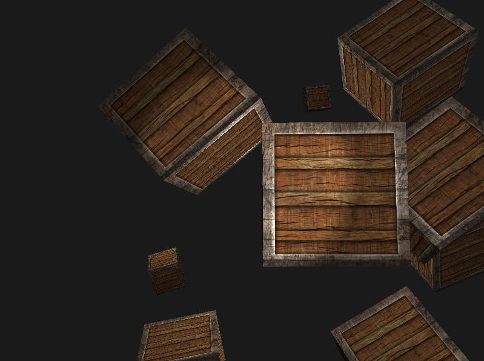

# Learn OpenGL in Rust
This repository contains examples based on the excellent book *"Learn OpenGL - Graphics Programming" by Joey de Vries*. The code in this repository reimplements the concepts from the book using the Rust programming language and includes experiments and refactored results.

Note: This code has only been tested on Linux.

The following is a list of the currently implemented examples:

- `demo1`: Covers triangles and shaders from the "Getting started" section of the book.
- `demo2`: Covers textures from the "Getting started" section of the book.
- `demo3`: Covers advanced textures from the "Getting started" section of the book.
- `demo4`: Covers transformations from the "Getting started" section of the book.
- `demo5`: Covers moving camera from the "Getting started" section of the book.
- `demo6`: Covers basic lighting from the "Lighting" section of the book.
- `demo7`: Covers Phong lighting from the "Lighting" section of the book.
- `demo8`: Covers materials in lighting from the "Lighting" section of the book.
- `demo9`: Covers lighting maps (diffuse and specular) from the "Lighting" section of the book.
- `demo10`: Covers directional lights from the "Lighting" section of the book.
- `demo11`: Covers point lights from the "Lighting" section of the book.

- `demo12`: Covers spotlights from the "Lighting" section of the book.
- `demo13`: Covers multiple lights from the "Lighting" section of the book.
- `demo14`: Covers loading 3D models using the assimp library from the "Model loading" section of the book.


More coming soon!

## Purpose
The purpose of this repository is to provide a resource for those who want to learn computer graphics using Rust and OpenGL. The examples in this repository serve as a starting point for further exploration and experimentation.

## Prerequisites
- Basic knowledge of Rust programming language
- Understanding of computer graphics concepts

## Getting Started
Install the [assimp library](https://github.com/assimp/assimp).

Clone the repository to your local machine:
```
git clone https://github.com/rrowniak/LearnOpenGLWithRust.git
```
Navigate to the repository directory:
```
cd LearnOpenGLWithRust
```
Run the examples:
```
cargo run demoN
```
Replace `N` with the number of the example you want to run, e.g.:
```
cargo run demo9
```

## Contributions
Contributions are welcome! If you have an example you'd like to add or improvements to existing examples, feel free to submit a pull request.

## Troubleshooting and Setup

### Environment Setup
Before running the examples in this repository, you may need to set up your environment.
```
sudo apt install libsdl2-gfx-dev
```

For testing and debugging purposes, you may also want to install the following:
```
sudo apt install mesa-utils
```

### OpenGL on Ubuntu with Dual Graphics Cards
If you have issues with OpenGL on Ubuntu with dual graphics cards, you can check which vendor's graphics card is active by running the following command:
```
glxinfo | grep OpenGL
```
You may see either
```
OpenGL vendor string: NVIDIA Corporation
```
or 
```
OpenGL vendor string: Intel
```

To check which graphics card is currently active, run the following command:
```
sudo prime-select query
```

If you want to switch to the NVidia graphics card, run the following command:
```
sudo prime-select nvidia
```

### Problem with OpenGL: Version Not Supported
If you encounter issues with the OpenGL version not being supported, you can check your OpenGL version by running the following command:
```
glxinfo | grep 'version'
```

You should get:
`OpenGL core profile version string: 4.6 (Core Profile) Mesa 22.2.5`

The minimum required version is OpenGL 3.3.

## Credits

This repository is based on the book "Learn OpenGL - Graphics Programming" by Joey de Vries. The code in this repository has been adapted and refactored to be written in the Rust programming language. The book can be found at [LearnOpenGL](https://learnopengl.com/).